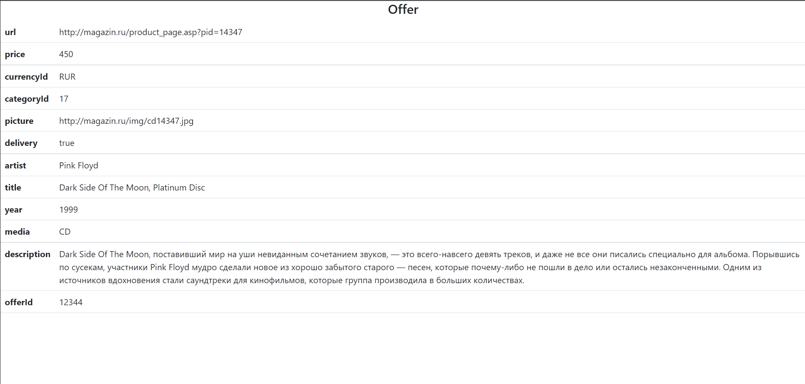

# Offers.Backend
Веб-проект ASP.NET Core на основе Onion-архитектуры. В Offers.Backend\Presentation\ArtistTitles.WebApi\Contents находится Index.html файл, отображающий результаты работы программы. 
___
При открытии страницы подгружается информация из XML файла. После её обработки формируется список offers, в котором происходит поиск offer с Id = 12344. Данный offer сохраняется в базу данных Postgre SQL посредством Entity Framework. Если такой offer уже существует в БД, сохраниния не происходит. Полученный offer отображается на View(Index.html). В [файле](Presentation/ArtistTitles.WebApi/Controllers/HomeController.cs) находится основная логика.

